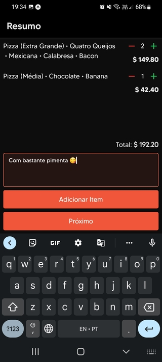
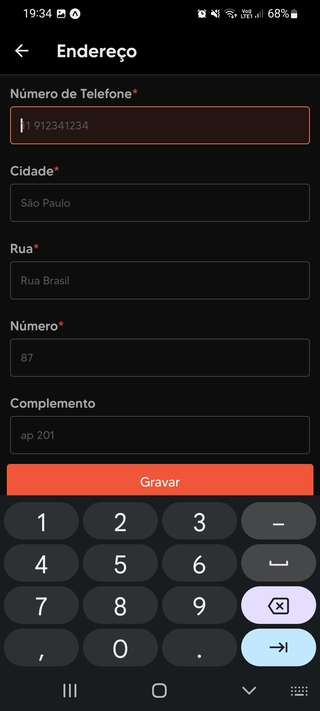

# Pizza Restaurant

Example app for a pizza restaurant.

## Tools

- React Native
- TypeScript
- Expo
- Native Base
- Redux
- React Navigation

## Features

- Light/dark mode
- Change app language
- App theme
- Custom font

## Run

Run in your own android/ios device with the Expo app by accessing [expo.dev/@matheuspuel/pizza-restaurant](https://expo.dev/@matheuspuel/pizza-restaurant) and scanning the QR code.

## Screenshots

